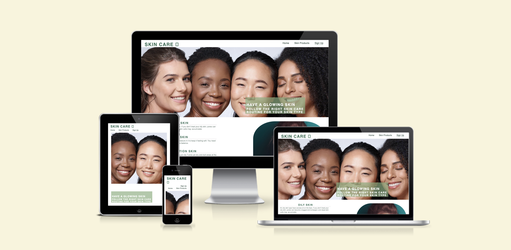

# Skin Care Website
(Developer: Selam Yigezu)
This website is aimed to target all people above the age of 12. It helps users to have glowing skin. Many people have problems with their facial skin just because they don't understand and know the skin type they have and the right product they have to use. It describes the types of skin, the skin care routine, and life styles.
 
 [Live Website](https://selamshim.github.io/skin-care/)

## Business Goals

### User Goals
- To care for skin
- To get best skin products and their link
- to know type of skin

### Website Owner Goals
- Deliver easy-to-use skincare website 
- Provide information about skin
- To suggest best products

### Target Audience
- People with all skin type
- everry one who who wants to have a glowing skin

### User Expectations
- The right information about skin
- the original link of best skin care products
- Appealing design
- Accessibility

# Features Left to Implement
- In this website users will get to know their types of skin and information about different products then they sign up choosing the type of skin they have. After they are signed up the website will suggest the right types of skin care products and routines they need to follow.
# Testing and validation
## Html Validation

•Navigation Bar

°The website has 3 pages which are responsive bars, they include Home page, Product page and Sign up page. the user can navigate with the pages without reverting back

•Home page landing image
°It contains an image which have a text explaining the aim of the website

•The skin-type section
° This section on the home page contains a detailed explanation about types of skin and it also has an image with a round shape.
•Routin section
°this section explains the right types of routine and life style users need to use to have a good looking skin
•Footer
This section includes links to the social media sites of skin care. They will be motivated to follow the right routine and care when they see people who have got a better skin on social media. The links will open to a new tab to allow easy navigation for the user.

•Skin Products
°this page shows different types of skin care products including their photos and description. If the user wants to read more about the product it also contains a link to the website of the product.
•Sign up page
°The user can sign up here choosing the type of skin he/she have and the site can suggest products according to there type

•Features Left to Implement
the website needs to accept the user detail and then suggest product

•Testing
°the project is tested on validator testing and also chrome DevTools
•Validator Testing
•HTML
°No errors were returned when passing through the official W3C validator
•CSS
°No errors were found when passing through the official (Jigsaw) validator

°Unfixed Bugs i was having problem to get a nice looking image for my home page so i bought from istock but ther resolution was high which affect the performance of the page. when i minimize the size of the image it wasnt looking that much good.

•Deployment
 °most of the time i was using my local Vs code editor and i was pushing code whenever i am done with one section. The site is deployed on github.
 °the live link is- https://selamshim.github.io/skin-care/

•Credits
°I have got help from tutor support and Love Running Project. I was able to have a good imagination and concept on how to design my sign up page and front home page image.
°The icons in the footer were taken from Font Awesome

•Media
The photos used on the home and sign up page are from : www.istockphoto.com and https://pixabay.com/
