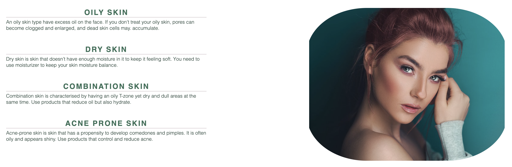
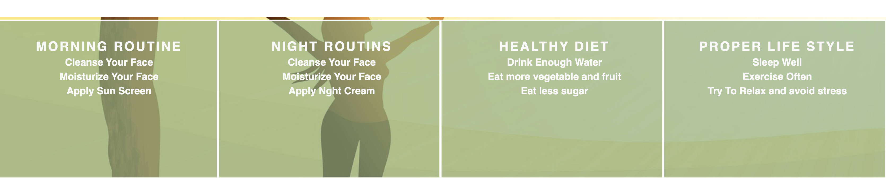
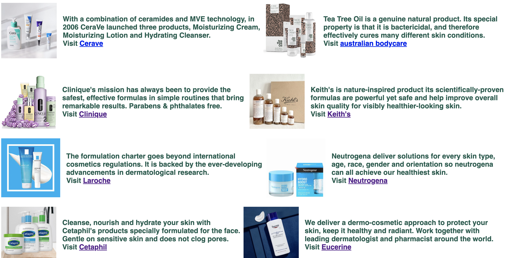

# Skin Care Website
(Developer: Selam Yigezu)
This website is aimed to target all people. It helps users to have glowing skin. Many people have problems with their facial skin just because they don't understand and know the skin type they have and the right product they have to use. It describes the types of skin, the skin care routine, and life styles.
 
 [Live Website](https://selamshim.github.io/skin-care/)

# Contents
## Features
 - The layout of all features responds to screensize and changes accordingly being responsive on mobiles, tablets and laptops as well as desktops.

### Header

The Header appears on all pages and is visible at all times when navigating the site. The logo on the left links to the home page and font awesome icons have been added. 

### Footer

The footer intention is to displays information about the social media link of the skin care website.

### Introduction page

A background image has been used to draw the user in, make clear what the site is about and it also describes the site is for all skin colored people the shortly displayed makes clear the subject of this website. 

### Skin Type

As displayed on the image above the skin type described on the left side of the page tells the type of skin a person can have and what should the person needs to do to have a nice looking skin. the image on the right side of the page is intendeded to motivate the user to have a clear skin like the woman on the image.

### Routine

As displayed on the image above the routine describes the steps everyone needs to follow and the life style a person can have for a better life and glowwing skin.

### Skin Product page

As displayed on the image above the product page contains the best products. Their description, image of the product and the orignal link of the product is displayed so that the users can look further detail about different products. The link of all the products open in a new page so that this website will remain open and the user can visit this website again.

### SignUp Page

As displayed on the image above the signup page used to sign up users based on their skin type and in the future it is intended to suggest skin care routines and type of product the person can use based on the skin type the user choose 

### 404
A 404 page has been included, in case of bugs within the code that prevent any links from working. 

### Features Left to Implement
In this website the user will be suggested the right types of skin care products and routines they need to follow based on the type of skin they choose while signing up. 

# Design

## The strategy plane

### User Goals
The primary target user group are peoples who wants to have a better looking skin and also peoples who have damaged skin due to  acne, skin product and wrong skin care routine.
- To care for skin
- To get best skin products and their link
- to know type of skin

### Website Owner Goals
Value for the owner of this website will be provided in:
- Deliver easy-to-use skincare website 
- Provide information about skin
- To suggest best products

### Target Audience
- People with all skin type
- everry one who who wants to have a glowing skin

### User Expectations
- The right information about skin
- the original link of best skin care products
- Appealing design
- Accessibility

# The Structure Plane 
The website will consist of three main pages – Home, Skin products and Signup page. Each of these will have a main section and an aside. 

### Home
- Introduction to site
 - Cover image 
 - Main title
 - short text explaining the intention of the page

- Skin types 
  -  Describe the four type of skinn a person
  - suggest what type of product a user can use based on the type   of skin the user have

- Skin Care Routine
  - Suggest morning and night routins
  - Suggest healty diet 
  - Suggest healty life style

### Skin Products
 - Image to the product
 - Description of the product
 - The orignal site of the product

 ### Sign up
 - A beautiful background image
 - A sign up form containing
   - First Name
   - Last name
   - Email Address
   - Password 
   - Skin type to choose

# Testing and validation

## Html Validation
- All Html file has been checked using [W3C validator](https://validator.w3.org/nu/?doc=https%3A%2F%2Fcode-institute-org.github.io%2Flove-maths%2F) and it returned "No errors or warnings to show"

## CSS Validation
- The file style.css has been checked using The W3C CSS Validation Service and validates as CSS level 3 + SVG.

# Features Left to Implement
the website needs to accept the user detail and then suggest product

### Unfixed Bugs
 - I was having problem to get a nice looking image for my home page so i bought from istock but ther resolution was high which affect the performance of the page. when i minimize the size of the image it wasnt looking that much good.

# Deployment

[Click Here To See The Live Website](https://selamshim.github.io/skin-care/)

### Deploy
The website was deployed through the use of GitHub Pages, a feature built in to GitHub. This can be done by following the steps below.
1. In the desired repository, click on "Settings" from the top menu.
2. From the side menu to your left, select "Pages" in the "Code and automation" section.
3. Make sure the "Source" option is set to "Deploy from a branch"
4. Select the desired "Branch" from the drop down below (main branch in most cases, making sure the director is set to /(root)).
5. Select "Save", and after it refreshes the page, you will see a box at the top of the page providing you with the URL of your now published site.

### Clone

1. Go to the desired repository
2. Click the "Code" button at the top of the files section of the page
3. Select your desired method for cloning (HTTPS/SSH/GitHub CLI)
4. Open Git Bash
5. Change the current working directory to the location where you want the cloned directory
6. Type "git clone", and then paste the URL you copied earlier. It will look like this, with your GitHub username instead of "YOUR-USERNAME": "$ git clone https://github.com/YOUR-USERNAME/DESIRED-REPOSITORY"
7. Press Enter. Your local clone will be created.

# Technologies Used

### Languages
The following languages were used to develop the website:
- HTML
- CSS

### Resources and Tools
The following resources and tools were used to develop the website:
- Git
- Github
- Gitpod
- Favicon
- DevTools
- W3 Schools
- Codecademy
- Google Fonts
- Font Awesome
- Stack Overflow
- The W3C Markup Validation Service
- the W3C CSS validation
- VS code

### Media
- The photos used on the home and sign up page are from: 
1. (https://www.istockphoto.com/se) and 
2. (https://pixabay.com/)

# Credits
- A list of references and tutorials used for the site:
* Template used to create this repository by Code Institute (ci-full-template).
* I have got help from tutor support 
* I was able to have a good imagination and concept on how to design my sign up page and front home page image with the help of Love Running Project 
* The icons in the footer were taken from Font Awesome
* Favicon and associated code was created using (https://favicon.io/)

# Acknowledgements

I would like to take this opportunity to acknowledge and thank the following people:

- Thank you for everybody on Code Institute's Slack Channels.
- Tutor from Code Institue. Thank you for the help.
- My loved husband, David , who helped me with taking care of my child.
- My Daughter Mikaela even if she was messing up my code by touching the keyboard suddenly she was always there with me.